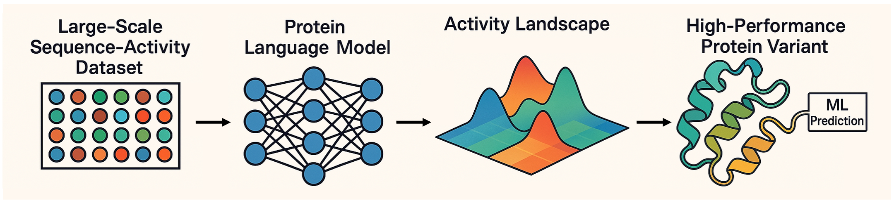

# SequenceDisplay-ML

This is the official repo for "Sequence Display enabled Machine Learning for Protein Evolution - SlugCas9 Case".

---


Sequence Display is an innovative platform that enables, for the first time, the generation of **large-scale protein sequence–activity datasets**. By integrating these comprehensive sequence–activity datasets with **pre-trained pLMs**, the platform reconstructs fine-grained, **variant-specific activity landscapes**, facilitating the discovery of **high-performance protein variants**. We successfully applied this platform to evolve **_Staphylococcus lugdunensis_ Cas9 (SlugCas9)** for expanded PAM recognition.


## 1. Environment Setup

### 1.1 Conda Env Setup
To set up the conda environment, please run the following command:
```bash
bash ./env/conda_setup.bash
```

### 1.2 Source Code Modification
Please refer to [ENV_README](./env/ENV_README.md).

## 2. Data Preparation

With Sequence Display, you will get mutated sequence and corresponding activity (average mutation number on four PAMs) pairs.
You can find the processed data in the './data/processed/5nnk/5nnk_nng_mut_num.csv' file.
The data is in the format of:
```cs
nnk1,nnk2,nnk3,nnk4,nnk5,count,NNGA,NNGT,NNGC,NNGG
Asn,Asn,Met,Glu,Lys,265,0.7849,0.0981,0.4415,0.9283
Asn,Gln,Leu,Ala,Glu,1725,0.7455,0.1426,0.4046,0.6857
```
The first five columns are the mutated amino acids. The sixth column is the count of the 5NNK combinations in Sequence Display.
The last four columns are the average mutation numbers on four PAMs (NNGA, NNGT, NNGC, NNGG).
To ensure the data's confidence, we only kept the data with a count greater than 100.

## 3. Model Training

In this project, we utilize two protein language models (pLMs) as the backbone of our model: ESM-2 and SaProt.
Please download the pre-trained models from this link: https://drive.google.com/drive/folders/1e6dtjGo7jNfAdiSCkvkubD48l42Vkyax?usp=drive_link, and put the model weights under `./data/params`.

We recommend you use GPUs with more than 40GB of memory for training. In addition, for better performance tracking, you are encouraged to use wandb.

### 3.1 ESM-2
All hyperparameters are set in `./config/config_esm2_train.yaml`.
To train the model, run the following command:
```bash
python train_esm.py
```

### 3.2 SaProt
All hyperparameters are set in `./config/config_saprot_train.yaml`.
To train the model, run the following command:
```bash
python train_saprot.py
```

## 4. Ensemble Model Training

To prepare for the virtual screening, we need to train the ensemble model.
We split the data into 5 folds, train the model on 4 folds, and test on the remaining fold.
A total of 10 models are trained, including 5 ESM-2 models and 5 SaProt models.

### 4.1 ESM-2 Ensemble
All hyperparameters are set in `./config/config_esm2_ensemble.yaml`.
To train the model, run the following command:
```bash
python train_esm_ensemble.py
```

### 4.2 SaProt Ensemble
All hyperparameters are set in `./config/config_saprot_ensemble.yaml`.
To train the model, run the following command:
```bash
python train_saprot_ensemble.py
```

## 5. Virtual Screening
With the trained ensemble model, we can perform virtual screening on the remaining 5NNK combinations.

### 5.1 ESM-2 Virtual Screening
All hyperparameters are set in `./config/config_esm2_vs.yaml`.
To perform virtual screening, run the following command:
```bash
python esm_vs.py
```

### 5.2 SaProt Virtual Screening
To accelerate the inference speed, we need to first tokenize the protein sequences.
Run the preprocessing file:
```bash
python saprot_vs_batch_conv.py
```

Then, run the inference file:
```bash
python saprot_vs.py
```
