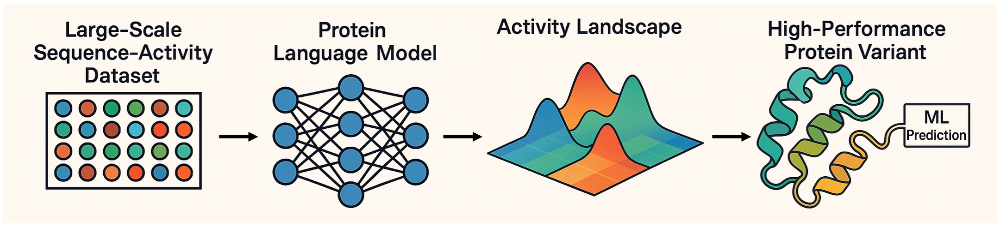

<div align="center">


# SequenceDisplay-ML

**Official repository for**  
**"Sequence Display enables large-scale sequence–activity datasets for rapid protein evolution."**

[](https://www.nature.com/articles/s41587-026-03087-3)
[](./LICENSE)

</div>

---



## Overview

Sequence Display is an experimental–computational platform enabling, for the first time, the large‑scale generation of protein sequence–activity datasets. By coupling these datasets with pre‑trained protein language models (pLMs), the platform reconstructs fine‑grained, variant‑level activity landscapes and accelerates discovery of high‑performance protein variants.  
We demonstrate the platform by engineering **_Staphylococcus lugdunensis_ Cas9 (SlugCas9)** toward broadened PAM recognition.

---

## 1. Environment Setup

### 1.1 Conda Environment
Create and configure the environment:
```bash
bash ./env/conda_setup.bash
```

### 1.2 Source Code Adjustments
Refer to: [ENV_README](./env/ENV_README.md).

---

## 2. Data Preparation

Sequence Display outputs (a) mutated sequence fragments (5 NNK positions) and (b) corresponding activity values (average mutation numbers across four PAM contexts).

Processed data file:  
`./data/processed/5nnk/5nnk_nng_mut_num.csv`

Format:
```text
nnk1,nnk2,nnk3,nnk4,nnk5,count,NNGA,NNGT,NNGC,NNGG
Asn,Asn,Met,Glu,Lys,265,0.7849,0.0981,0.4415,0.9283
Asn,Gln,Leu,Ala,Glu,1725,0.7455,0.1426,0.4046,0.6857
```

Field description:
- Columns 1–5: Amino acids observed at the five NNK‑mutated positions (translated form).
- Column 6 (count): Observed frequency of that 5‑tuple in Sequence Display.
- Columns 7–10: Average mutation numbers under PAMs NNGA, NNGT, NNGC, NNGG.

Quality filter: Only entries with count > 100 are retained to ensure statistical reliability.

---

## 3. Single-Model Training

Two pLM backbones are supported: **ESM-2** and **SaProt**.  
Download required pre-trained weights from:  
https://drive.google.com/drive/folders/1e6dtjGo7jNfAdiSCkvkubD48l42Vkyax?usp=drive_link  
Place files under: `./data/params`

Resource guidance:
- Recommended: ≥ 40 GB GPU memory.
- Optional tracking: Weights & Biases (wandb) integration (configure in YAML).

### 3.1 ESM-2
Hyperparameters: `./config/config_esm2_train.yaml`  
Run:
```bash
python train_esm.py
```

### 3.2 SaProt
Hyperparameters: `./config/config_saprot_train.yaml`  
Run:
```bash
python train_saprot.py
```

---

## 4. Ensemble Training

Purpose: Improve robustness and enable virtual screening over unobserved 5NNK combinations.  
Procedure: 5-fold split; for each fold, train on 4 folds, evaluate on the held‑out fold.  
Total models: 10 (5 ESM-2 + 5 SaProt).

### 4.1 ESM-2 Ensemble
Config: `./config/config_esm2_ensemble.yaml`  
Run:
```bash
python train_esm_ensemble.py
```

### 4.2 SaProt Ensemble
Config: `./config/config_saprot_ensemble.yaml`  
Run:
```bash
python train_saprot_ensemble.py
```

---

## 5. Virtual Screening

After ensemble training, screen the remaining (unseen) 5NNK sequence space.

### 5.1 ESM-2 Virtual Screening
Config: `./config/config_esm2_vs.yaml`  
Run:
```bash
python esm_vs.py
```

### 5.2 SaProt Virtual Screening
Pre-tokenize to accelerate inference:
```bash
python saprot_vs_batch_conv.py
```
Then run inference:
```bash
python saprot_vs.py
```

---

## 6. License and Attribution

Licensed under Apache 2.0 (see LICENSE).  
If you use the code, models, or datasets, cite the Sequence Display manuscript.  
Include a notice of any file modifications.

---

## 7. Disclaimer

This repository is for research use. Performance on additional proteins or mutation regimes may require retraining or adaptation.

---

## Citation

If you find this repository useful, please cite:

```bibtex
@article{Cheng2026SequenceDisplay,
  author  = {Linqi Cheng and Xinzhe Zheng and Shiyu Jason Jiang and Yu Hu and Yijie Liu and Kaiqiang Yang and Jinyan Rui and Haoxue Ding and Mengxi Zhang and Teng Yuan and Qianglan Lu and Haoxin Ye and Chen-Long Li and Yiming Guo and Zuotong Tian and Anna Qin and Boyang Zhou and Kevin K. Yang and Xiongyi Huang and Han Xiao},
  title   = {Sequence Display enables large-scale sequence–activity datasets for rapid protein evolution},
  journal = {Nature Biotechnology},
  year    = {2026},
  doi     = {10.1038/s41587-026-03087-3},
  url     = {https://doi.org/10.1038/s41587-026-03087-3}
}
